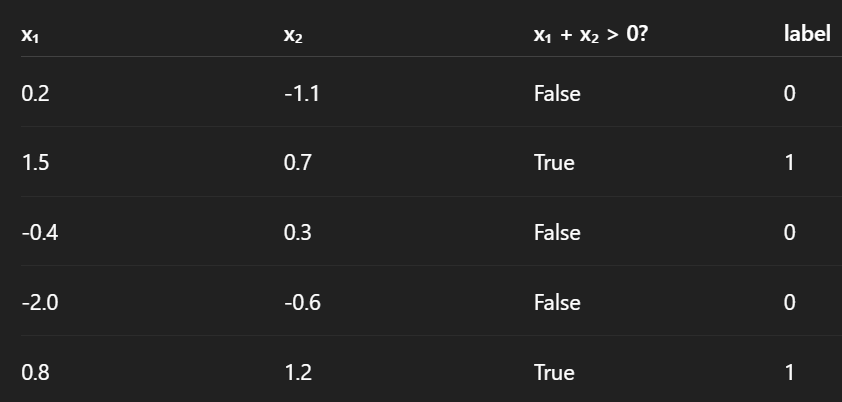

# data.py
np.random.randn
np.random.randn is a NumPy function that generates random numbers from a standard normal distribution: Mean (μ) = 0
Standard deviation (σ) = 1
Distribution shape = bell curve (Gaussian)

randn is shorthand for “random normal” — but always standard normal.

<!-- def generate_linear_data(n=100):
    X=np.random.randn(n,2)
    y=(X[:,0]+X[:,1]>0).astype(int)
    return X,y -->
function creates a 2-D synthetic classification dataset.
X → n samples, 2 features, from standard normal distribution (randn)
y → label 0 or 1, depending on whether the sum of the two features is greater than 0
The decision boundary is a straight line: x₁ + x₂ = 0

# task0.py
The code generates a synthetic 2-feature dataset labeled by a linear rule (`x₁ + x₂ > 0`) and visualizes it using a 2D scatter plot. 
The `main()` function creates the data and calls the plotting utility, while the `if __name__ == "__main__"` block ensures the script runs only when executed directly.

# task1.py
Loads a synthetic **XOR classification dataset** (2-feature, binary labels) and visualizes it in 2D. 
The `main()` function generates the data and passes it to a scatter plot utility. 
The `if __name__ == "__main__"` block ensures the script runs only when executed directly.

# task2.py
Generates **200 samples of 2-D XOR data** (labels form a cross pattern, not linearly separable), then:
1. Trains **logistic regression directly** → performs poorly because XOR can’t be solved with a straight line.
2. Transforms features into **2nd-degree polynomial terms**.
3. Trains logistic regression again on transformed data → **higher accuracy**, as polynomial features create a curved boundary that can separate XOR classes.

Summary:
Generates a 2-D XOR dataset and evaluates logistic regression before and after polynomial feature transformation. 
The linear model fails to classify XOR correctly, while the degree-2 polynomial features enable a non-linear decision boundary, significantly improving accuracy.

# VersionControl, Commits, Error file and challenges
# Regular commit must
# Try on different Kernels 
# Name the file according to the project and push to git

# task3.py
Generates 2-D XOR data and tests SVM classifiers with different kernels. The **linear kernel fails** because XOR is not linearly separable, while the **polynomial (degree-2) and RBF kernels succeed** by learning non-linear decision boundaries. It also visualizes predictions and prints accuracy for each model.

